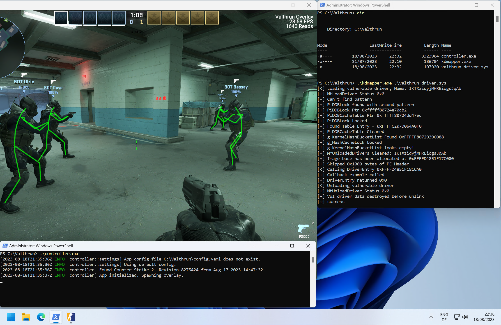

# 🎯 Valthrun CS2 - Educational Research Project


<p align="center">
  <strong>⚠️ EDUCATIONAL PURPOSE ONLY ⚠️</strong><br>
  <strong>🚫 DO NOT USE IN ACTUAL CS2 GAMEPLAY 🚫</strong>
</p>

<p align="right">
<a href="https://discord.gg/ecKbpAPW5T">

</a>
</p>

---

## 📚 Educational Disclaimer

**THIS PROJECT IS FOR EDUCATIONAL AND RESEARCH PURPOSES ONLY**

This repository contains a forked version of Valthrun, a Counter-Strike 2 external analysis tool, modified purely for:
- **Learning Rust programming language**
- **Understanding game memory analysis techniques**
- **Research into Windows kernel-level programming**
- **Academic study of external process interaction**
- **Security research and reverse engineering education**

## ⚠️ IMPORTANT WARNINGS

### 🚫 **DO NOT USE THIS SOFTWARE:**
- ❌ **In any online Counter-Strike 2 matches**
- ❌ **On any VAC-secured servers**
- ❌ **For competitive advantage**
- ❌ **To violate game terms of service**
- ❌ **In any way that could result in account bans**

### ⚖️ **Legal and Ethical Considerations:**
- This software may violate Valve's Terms of Service
- Using this in CS2 can result in **PERMANENT VAC BANS**
- Account bans may affect your Steam inventory and other games
- We take **NO RESPONSIBILITY** for any consequences of use
- This is provided for educational analysis only

---

## 🎓 What This Project Teaches

### Programming Concepts:
- **Rust Language**: Advanced Rust programming patterns and memory safety
- **Windows Kernel Programming**: Low-level system interaction
- **Memory Analysis**: External process memory reading techniques
- **Graphics Programming**: Overlay rendering with ImGui
- **Network Programming**: Radar functionality implementation

### Security Research:
- **Reverse Engineering**: Understanding game engine architecture
- **Anti-Cheat Evasion**: How detection systems work (for defensive purposes)
- **Process Injection**: External vs internal analysis methods
- **Kernel-Level Access**: Windows driver development concepts

### Game Development:
- **3D Mathematics**: Coordinate transformations and projections
- **Entity Systems**: Understanding game object hierarchies
- **Real-time Rendering**: Overlay and graphics optimization
- **Network Protocols**: Game state synchronization

---

## 🔧 Technical Features (For Educational Analysis)

### Core Architecture:
- **External Read-Only Access**: No game process modification
- **Kernel-Level Implementation**: Windows driver-based memory access
- **Multi-Component Design**: Modular Rust architecture
- **Real-time Processing**: Efficient memory scanning and analysis

### Educational Components:
- **Entity System Parser**: Learn how games organize objects
- **3D Math Library**: Vector operations and transformations
- **Memory Pattern Scanning**: Signature-based memory analysis
- **Overlay Rendering**: DirectX/OpenGL integration with ImGui
- **Network Communication**: UDP-based radar system

---

## 📖 Learning Resources

### Recommended Reading:
1. **Rust Programming**: 
   - [The Rust Programming Language](https://doc.rust-lang.org/book/)
   - [Rust by Example](https://doc.rust-lang.org/rust-by-example/)

2. **Windows Kernel Development**:
   - Windows Kernel Programming by Pavel Yosifovich
   - Windows Internals by Mark Russinovich

3. **Game Engine Architecture**:
   - Game Engine Architecture by Jason Gregory
   - Real-Time Rendering by Tomas Akenine-Möller

4. **Reverse Engineering**:
   - Practical Reverse Engineering by Bruce Dang
   - The IDA Pro Book by Chris Eagle

---

## 🏗️ Project Structure

```
Valthrun-Educational/
├── controller/          # Main GUI application
│   ├── src/
│   │   ├── main.rs     # Application entry point
│   │   ├── settings/   # Configuration management
│   │   └── utils/      # Helper utilities
├── cs2/                # Game-specific analysis
│   ├── src/
│   │   ├── offsets.rs  # Memory offset definitions
│   │   ├── entity/     # Game entity parsing
│   │   └── schema/     # Game data structures
├── overlay/            # Graphics overlay system
├── radar/              # Network radar implementation
└── utils/              # Shared utilities
```

---

## 🧪 Safe Testing Environment

**If you must test this software for educational purposes:**

1. **Use Offline Only**:
   - Local server with bots only
   - `-insecure` launch parameter
   - No internet connection

2. **Separate Steam Account**:
   - Use a throwaway account
   - Do not link to main account
   - Accept risk of permanent ban

3. **Virtual Machine**:
   - Run in isolated environment
   - Easy to reset if needed
   - Prevents system-wide issues

---

## 🤝 Contributing to Education

This project welcomes educational contributions:

- **Code Documentation**: Help explain complex concepts
- **Educational Examples**: Add learning-focused examples
- **Research Papers**: Academic analysis of techniques
- **Security Analysis**: Responsible disclosure of vulnerabilities

### Contribution Guidelines:
1. All contributions must maintain educational focus
2. No optimizations for actual gameplay use
3. Include detailed educational comments
4. Add appropriate warnings and disclaimers

---

# Original Valthrun Information

Valthrun is an open source external Counter-Strike 2 read only kernel-level gameplay enhancer.  
That's a lot of descriptive words, but what does each of them mean?  
- `Valthrun` The name of this project
- `open source` This application is open source and for everyone to learn from
- `external` We do not inject any DLLs into the target process
- `read only` We do not write to the CS2 process in any way, therefore being impossible to detect by scanning the process memory
- `kernel` We do not use any user level WinAPIs in order to get information from the CS2 process
  
This project is mainly a fun example for exploring the Windows Kernel with [Rust](https://www.rust-lang.org) and exploring the world of game enhancements :)

## WARNING
Valthrun is **not** a plug 'n play solution.  
Instead Valthrun aims to achieve maximum stealth and stay invisible for other applications.  
Please read [How to use](https://wiki.valth.run/getting-started/) carefully and try troubleshooting issues on your own.  

## Features
Due to Valthrun being read-only (as of now), there are limitations on what features are possible to implement (eg. skin changer).
Regardless of this limitation, Valthrun supports the following features:  

- External radar  
  Publish your game for everybody on https://radar.valth.run
- Player ESP  
  ESP with a lot of configuration possibilities like: `Skeleton`, `Boxes3D` and `Boxes2D` 
  - Configurable colors to distinguish between enemy and team players
  - ESP includes player health, a health bar, weapon and a lot more
- Bomb Info
  - Time until the bomb detonation
  - Defuser info such as a defuse timer
  - Bomb site where the bomb is located
- Trigger Bot  
  Shoot your enemy (or team mates) as soon they enter your crosshair
- Spectator info
  - List of player currently watching you / the observer target
- Stream proof by default  
  Never show your Valthrun overlay on any screen shares

To access Valthruns settings overlay press `PAUSE`.

### Planned Features
- Aimbot
- Player competitive ranks / wins

## How to use / Getting started
Please follow this guide to get started:  
https://wiki.valth.run/getting-started/

## Troubleshooting
If you are having issues mapping the kernel driver or starting the controller, please take a look [here](https://wiki.valth.run/category/troubleshooting):  
https://wiki.valth.run/category/troubleshooting
  
The issue you encounter is most likely covered. If you still have any questions or need assistance, feel free to checkout the official Valthrun Discord server ([click to join](https://discord.gg/ecKbpAPW5T)).

## VAC
The same considerations as mentioned in [this link](https://github.com/dretax/GarHal_CSGO#starting-driver) have been taken into account.  
With these precautions and some minor improvements, such as omitting the Valthrun identifier and using xor encryption for strings, the driver/overlay should avoid VAC detection. However, I must clarify that I haven't extensively studied VAC, so my conclusion is speculative. Personally, I have been using a C based driver/overlay like this with CSGO for several years without ever getting VAC banned. But be aware of overwatch!  
With VAC live being enabled now, use this with caution. As always take the necessary precautions into consideration.

---

## 📜 License and Responsibility

This project is licensed for educational use only. By accessing this code:

- You acknowledge this is for learning purposes only
- You agree not to use it in actual CS2 gameplay
- You understand the risks of VAC bans and accept full responsibility
- You will not distribute compiled versions for gameplay use
- You will include these disclaimers in any derivative works

---

## 🔗 Educational Resources

### Official Documentation:
- [Rust Documentation](https://doc.rust-lang.org/)
- [Windows Driver Kit](https://docs.microsoft.com/en-us/windows-hardware/drivers/)
- [ImGui Documentation](https://github.com/ocornut/imgui)

### Academic Papers:
- "Analysis of Anti-Cheat Systems in Online Gaming"
- "Kernel-Level Security in Windows Applications"
- "Memory Analysis Techniques for Security Research"

### Online Courses:
- Rust Programming Specialization (Coursera)
- Windows Kernel Programming (Pluralsight)
- Game Engine Development (edX)

---

## ❓ Frequently Asked Questions

**Q: Can I use this to get better at CS2?**
A: **NO.** This is for learning programming and security concepts only.

**Q: Will I get banned if I run this?**
A: **YES, VERY LIKELY.** Do not run this with CS2 or any VAC-secured game.

**Q: Is this legal?**
A: While reverse engineering for educational purposes may be protected, using this in CS2 violates Terms of Service.

**Q: How do I compile this?**
A: See the technical documentation, but remember: **EDUCATIONAL USE ONLY.**

---

# Screenshots



# Help
You can find help on the official Valthrun Discord server:  
[](https://discord.gg/ecKbpAPW5T)

---

<p align="center">
  <strong>🎓 Learn Responsibly | Code Ethically | Respect Game Integrity 🎓</strong><br>
  <em>Educational advancement should never come at the cost of fair play</em>
</p>

---

*This educational project is not affiliated with Valve Corporation or Counter-Strike 2. All trademarks are property of their respective owners.*
